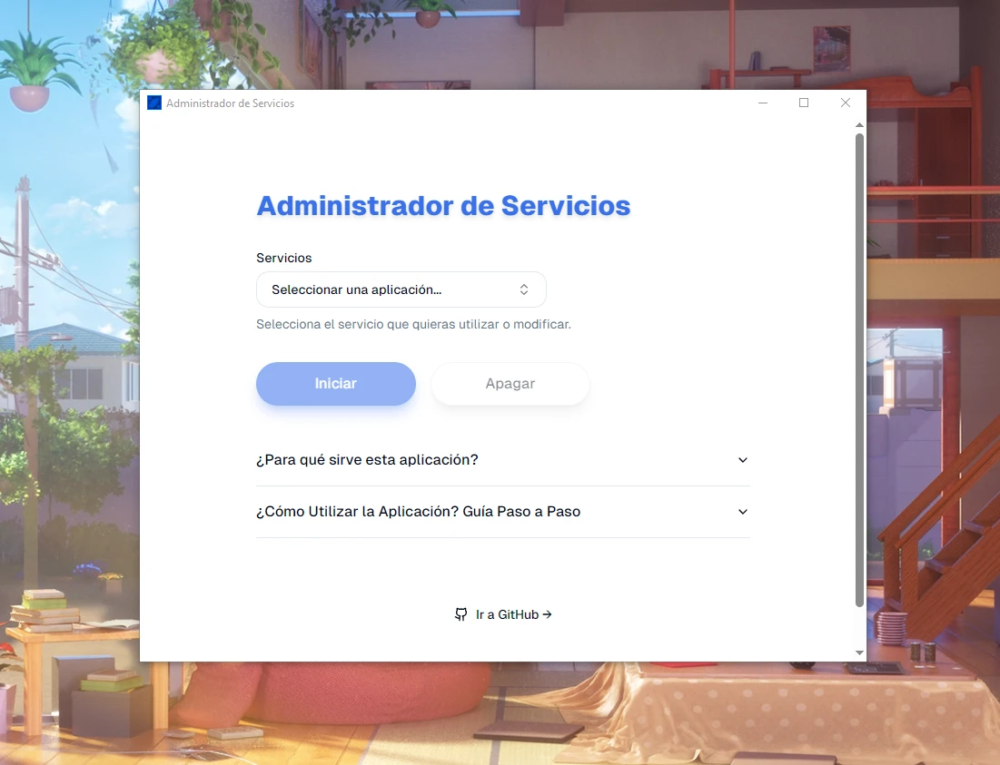

#  Controlador de Servicios de Windows

[]()
[]()
[]()
[]()
[]()
[]()
[]()



**Controlador de Servicios de Windows** es una aplicación diseñada para facilitar la gestión de servicios en sistemas Windows.
Permite iniciar, detener y configurar el modo de inicio de cualquier servicio de forma sencilla. Esta herramienta es ideal para usuarios y desarrolladores que buscan controlar los servicios de Windows de manera eficiente.

> [!NOTE]
> Puedes descargar el ejecutable desde el siguiente enlace: [Administrador-de-Servicios.exe](https://github.com/MrSCR98/Administrador-de-Servicios/releases/download/Ejecutable/Administrador-de-Servicios.exe)

## ¿Cómo utilizar la aplicación? Guía paso a paso

1. **Inicia la aplicación como administrador**: Es necesario ejecutar la aplicación con privilegios de administrador para modificar los servicios del sistema.
2. **Selecciona el servicio que deseas gestionar**: En la interfaz de la aplicación, elige el servicio que quieres iniciar, detener o configurar.

3. **Configura el tipo de inicio**: Si deseas controlarlo manualmente, cambia el tipo de inicio a **Manual**. Por defecto, muchos servicios se configuran en **Automático (Inicio retrasado)**, lo que puede no ser necesario si no se usan constantemente.

4. **Inicia el servicio**: Para iniciar el servicio seleccionado, haz clic en el botón **Iniciar**. Esto ejecutará un comando como el siguiente:

   ```bash
   net start <nombre-del-servicio>
   ```

   

5. **Detén el servicio**: Si deseas detener el servicio manualmente, haz clic en el botón **Apagar**. Esto ejecutará un comando como:
   ```bash
   net stop <nombre-del-servicio>
   ```
   Aunque normalmente algunos servicios se detendrían al apagar el equipo, esta opción te permite detenerlos de forma manual cuando lo necesites.
   
   

## ¿Para qué sirve esta aplicación?

Esta aplicación fue desarrollada para ayudar a los usuarios a gestionar servicios en sistemas Windows, específicamente para iniciar o detener servicios de forma manual. Además, permite cambiar el tipo de inicio, lo cual es útil para optimizar recursos del sistema cuando algunos servicios no se usan constantemente.

Por defecto, muchos servicios en Windows se configuran para iniciarse automáticamente. Aunque esto no suele consumir muchos recursos, puede ser innecesario si no los usas todo el tiempo. Con esta herramienta puedes configurar cada servicio para que se inicie solo cuando lo necesites.

> [!IMPORTANT]  
> La aplicación debe ejecutarse como **Administrador** para poder modificar los servicios del sistema.

> [!WARNING]  
> Al ejecutar la aplicación, es posible que tu antivirus te muestre una alerta ya que el ejecutable no está firmado. Esto ocurre porque la aplicación no está firmada por una entidad certificada. Sin embargo, puedes crear el ejecutable tú mismo siguiendo los pasos de compilación detallados a continuación. Si confías en el origen del código, puedes continuar sin problemas.

## Requisitos

Para ejecutar la aplicación, necesitas tener instalados los siguientes programas:

- **Node.js**: Asegúrate de tener la versión recomendada de Node.js instalada en tu sistema.
- **Rust**: Rust es necesario para la parte de compilación de Tauri.

## Instalación y Ejecución

Sigue estos pasos para instalar y ejecutar la aplicación en tu sistema:

1. **Instala las dependencias de Node.js**:

   ```bash
   npm i
   ```

2. **Ejecuta la aplicación en modo desarrollo**:

   ```bash
   npx tauri dev
   ```

3. **Compila la aplicación para producción**:

   ```bash
   npx tauri build
   ```

4. **Genera el icono de la aplicación** (asegúrate de tener el archivo del ícono en ./app-icon.png):

   ```bash
   npx tauri icon
   ```

## Contribuciones

Este proyecto está disponible para su mejora. Si tienes sugerencias o deseas contribuir, no dudes en abrir un **Pull Request** o reportar problemas a través de **Issues** en el repositorio.

---

¡Gracias por usar esta herramienta! Esperamos que te facilite la gestión de servicios en tu entorno de desarrollo o producción en Windows.
